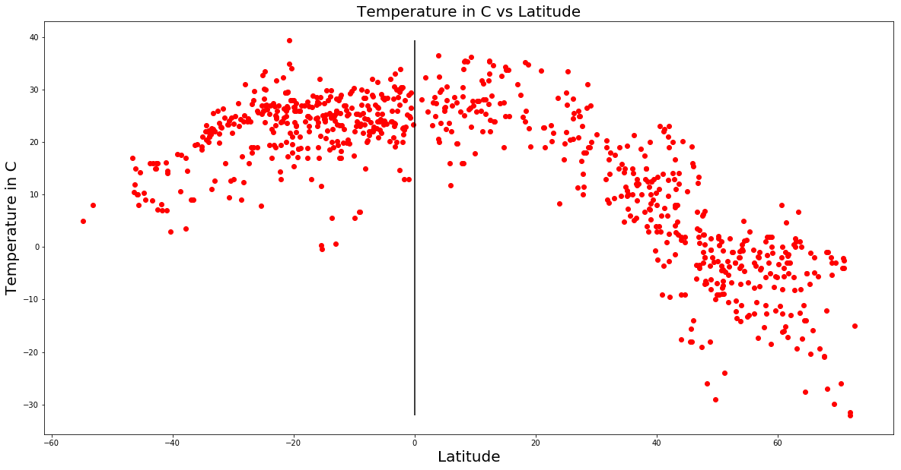
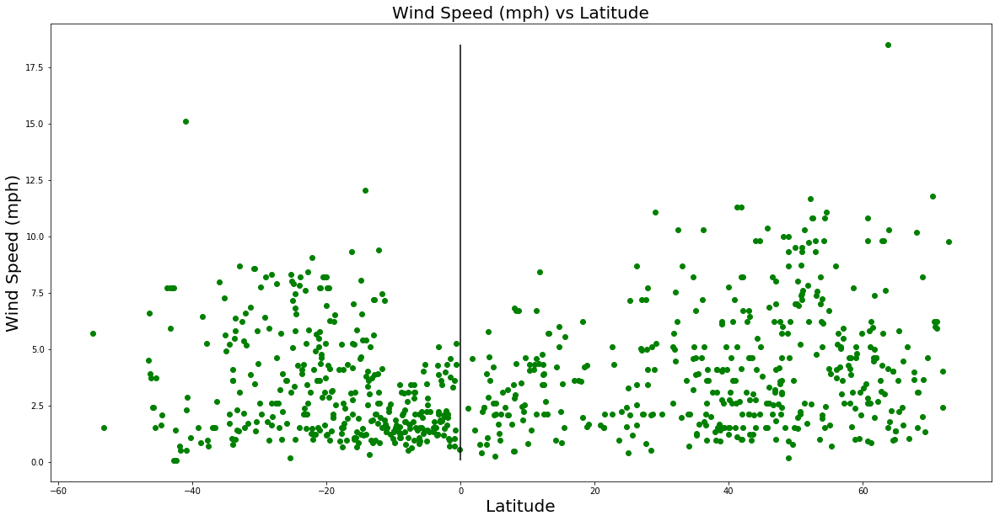

You can veiw the analysis in my webpage https://mitrapiya25.github.io/weatheranalysis/ .
The weather data captured is for 3/17/2018. From the plot of Temperature vs Latitude we observe that the temperature near the Equator (0 Latitude) is always higher. The temperature starts falling as we go away from the equator on both south and north direction, going below 0 beyond 40 Lat.Humidity is High on the southern Hemisphere near the equator but not so in the northen Hemisphere. Another climatic condition near the Equator is the rain and cloud. The rainfall definitley is less as we go away from the Equator. The concentration on Cloudiness is heavy in some parts away from the equator, but so is the concentraion of Clear Skies. Parts where humidity is High is also has Rainy weather.

```python
##Dependencies
import pandas as pd
import numpy
from citipy import citipy
import openweathermapy.core as owm
import time
import random
import matplotlib.pyplot as plt
from config import owm_key
```


```python
##to run it elsewhere one can provide own access key
api_key = owm_key
```


```python
## divided the Latitude to positvie and negative range to get maximum coverage on both sides of the Equator
latitude_pos = random.sample(range(0,90),90)
latitude_neg = random.sample(range(-90,0),90)
longitude = random.sample(range(-180,180),40)
## Creating a Dataframe to store all data
city_data=[{"City":"",
           "City Number":"",
           "Latitude" :"",
           "Longitude":"",
           "Temperature":"",
           "Humidity":"",
           "Cloudiness":"",
           "Wind Speed":""}]
city_data_df = pd.DataFrame(city_data)

```


```python
##Looping thorugh positive and negative latitude separately
index =0
for x in latitude_pos:
    for y in longitude:
        try:
            city_data =citipy.nearest_city(x,y)
            city_data_df.loc[index,"City"] = city_data.city_name
            city_data_df.loc[index,"Country"] = city_data.country_code
            city_data_df.loc[index,"Latitude"] = x
            city_data_df.loc[index,"Longitude"] = y
        except:
            continue
        index = index +1
        
for i in latitude_neg:
    for j in longitude:
        try:
            city_data =citipy.nearest_city(i,j)
            city_data_df.loc[index,"City"] = city_data.city_name
            city_data_df.loc[index,"Country"] = city_data.country_code
            city_data_df.loc[index,"Latitude"] = i
            city_data_df.loc[index,"Longitude"] = j
        except:
            continue
        index = index +1

        
        
        
        
```


```python
##removing the duplicate citites
city_data_df = city_data_df.drop_duplicates("City")
```


```python
##taking a sample of cities with positive latitude as the number was large
city_data_df_1 = city_data_df.loc[city_data_df.Latitude > 0,:].sample(frac= .45)

```


```python
##concatenating the DF for positive and negative latitue cities
city_data_df_final = pd.concat([city_data_df.loc[city_data_df.Latitude < 0,:],city_data_df_1])
city_data_df_final= city_data_df_final.reset_index(drop = True)
```


```python
## making API calls to get the weather details for each city
settings = {"APPID": api_key, "units": "metric"}
for row in range(0,len(city_data_df_final)-1):
    time.sleep(.5)
    qry_str = city_data_df_final.loc[row,"City"] + "," + city_data_df_final.loc[row,"Country"]
    try:
        data =owm.get_current(qry_str,**settings)
        print("City name :"+ data["name"] + " City Id : " + str(data["id"]))
        city_data_df_final.loc[row,"City Number"] = data["id"]
        city_data_df_final.loc[row,"Latitude"] = data['coord']["lat"]
        city_data_df_final.loc[row,"Longitude"] = data['coord']["lon"]
        city_data_df_final.loc[row,"Humidity"] = data["main"]["humidity"]
        city_data_df_final.loc[row,"Temperature"] = data["main"]["temp"]
        city_data_df_final.loc[row,"Wind Speed"] =data["wind"]["speed"]
        city_data_df_final.loc[row,"Cloudiness"]=data["weather"][0]["main"]
        
    except:
        print("This City is not found in Weather map" + qry_str )
        continue
    
```

    City name :Bulungu City Id : 2316259
    City name :Hithadhoo City Id : 1282256
    This City is not found in Weather maputiroa,ki
    City name :Sampit City Id : 1628884
    City name :Iquitos City Id : 3696183
    City name :Dongobesh City Id : 160172
    City name :Isaka City Id : 159045
    City name :Lodja City Id : 211647
    City name :Gamba City Id : 2400547
    City name :Barranca City Id : 3946820
    City name :Cabedelo City Id : 3404558
    City name :Bandundu City Id : 2317397
    City name :Mombasa City Id : 186301
    This City is not found in Weather mapsanta ines,br
    This City is not found in Weather mapbur gabo,so
    City name :Uvira City Id : 204405
    City name :Malindi City Id : 187968
    City name :Maues City Id : 3395062
    This City is not found in Weather mapsamusu,ws
    City name :Padang City Id : 1633419
    City name :Hermanus City Id : 3366880
    City name :Te Anau City Id : 2181625
    City name :Saint-Philippe City Id : 935215
    City name :Pareora City Id : 2181133
    City name :Jamestown City Id : 3370903
    City name :Albany City Id : 2077963
    This City is not found in Weather mapmataura,pf
    City name :Coihaique City Id : 3894426
    City name :East London City Id : 1006984
    This City is not found in Weather maptaolanaro,mg
    City name :Rikitea City Id : 4030556
    City name :Portland City Id : 2152668
    City name :Cape Town City Id : 3369157
    City name :Port Alfred City Id : 964432
    City name :Plettenberg Bay City Id : 964712
    City name :Castro City Id : 3896218
    City name :Arraial do Cabo City Id : 3471451
    This City is not found in Weather mapumzimvubu,za
    City name :Rocha City Id : 3440777
    This City is not found in Weather maptsihombe,mg
    City name :Port Elizabeth City Id : 964420
    City name :Saldanha City Id : 3361934
    City name :Vaini City Id : 4032243
    City name :Necochea City Id : 3430443
    City name :Avarua City Id : 4035715
    City name :Busselton City Id : 2075265
    City name :Vredendal City Id : 3359736
    City name :Ahipara City Id : 2194098
    City name :Mahebourg City Id : 934322
    City name :Ovalle City Id : 3877918
    City name :Richards Bay City Id : 962367
    City name :Broken Hill City Id : 2173911
    City name :Luderitz City Id : 3355672
    City name :Durban City Id : 1007311
    City name :De Aar City Id : 1011632
    City name :Coquimbo City Id : 3893629
    City name :Sao Joao da Barra City Id : 3448903
    City name :Springbok City Id : 3361142
    City name :Beloha City Id : 1067565
    This City is not found in Weather maplaguna,br
    City name :Elliot City Id : 1005781
    City name :Salto City Id : 3440714
    City name :Lebu City Id : 3883457
    City name :Carnarvon City Id : 2074865
    City name :Bredasdorp City Id : 1015776
    City name :Bluff City Id : 2206939
    City name :Ushuaia City Id : 3833367
    City name :Hobart City Id : 2163355
    City name :Kruisfontein City Id : 986717
    City name :Punta Arenas City Id : 3874787
    City name :Mar del Plata City Id : 3863379
    City name :New Norfolk City Id : 2155415
    City name :Kaitangata City Id : 2208248
    City name :Chuy City Id : 3443061
    City name :Cidreira City Id : 3466165
    City name :Souillac City Id : 933995
    City name :Okato City Id : 2185763
    City name :Angol City Id : 3899629
    City name :Mount Gambier City Id : 2156643
    City name :Margate City Id : 978895
    City name :Rio Grande City Id : 3451138
    This City is not found in Weather maplata,sb
    This City is not found in Weather maplolua,tv
    City name :Paciran City Id : 1633442
    City name :Saquena City Id : 3692020
    City name :Mungaa City Id : 152546
    City name :Kiunga City Id : 2093846
    City name :Omboue City Id : 2396853
    City name :Tabora City Id : 149658
    City name :Lusambo City Id : 210379
    City name :Kasongo-Lunda City Id : 2315026
    City name :Micheweni City Id : 153955
    This City is not found in Weather mapgrajau,br
    City name :Lamu City Id : 189741
    City name :Kongolo City Id : 212360
    City name :Jacareacanga City Id : 3397763
    City name :Vao City Id : 2137773
    City name :Ritchie City Id : 961226
    City name :Vila Velha City Id : 6320062
    City name :Oranjemund City Id : 3354071
    City name :Imbituba City Id : 3461370
    This City is not found in Weather maphlotse,ls
    City name :Mercedes City Id : 3430709
    City name :Keetmanshoop City Id : 3356264
    City name :Copiapo City Id : 3893656
    City name :Xai-Xai City Id : 1024552
    City name :Walvis Bay City Id : 3359638
    City name :Nsoko City Id : 934900
    City name :Kuruman City Id : 986134
    City name :Bethanien City Id : 3358416
    This City is not found in Weather maptoliary,mg
    City name :Porto Belo City Id : 3452900
    City name :Deneysville City Id : 1010962
    City name :Pilar City Id : 3437526
    City name :Saint-Pierre City Id : 935214
    City name :Lumajang City Id : 1637090
    City name :Porto Walter City Id : 3662761
    City name :Malangali City Id : 155052
    City name :Ambilobe City Id : 1082243
    City name :Merauke City Id : 2082539
    City name :Mlowo City Id : 153352
    City name :Kaniama City Id : 214389
    City name :Soyo City Id : 2236967
    City name :Tocache City Id : 3691324
    City name :Pitimbu City Id : 3391889
    City name :Kilindoni City Id : 157429
    City name :Balsas City Id : 3406545
    City name :Mitsamiouli City Id : 921786
    City name :Manono City Id : 209598
    This City is not found in Weather mapbengkulu,id
    City name :Wanaka City Id : 2184707
    This City is not found in Weather mapfairlie,nz
    City name :Rakaia City Id : 2183824
    City name :Gobabis City Id : 3357247
    City name :Tadine City Id : 2138285
    This City is not found in Weather mapgrand river south east,mu
    City name :Isangel City Id : 2136825
    City name :Tocopilla City Id : 3869716
    City name :Maxixe City Id : 1039536
    City name :Mananjary City Id : 1056151
    City name :Mount Isa City Id : 2065594
    City name :Chiredzi City Id : 893485
    This City is not found in Weather maptsienyane,bw
    City name :Henties Bay City Id : 3356832
    City name :Caravelas City Id : 3466980
    City name :Okahandja City Id : 3354898
    City name :Pouso Alegre City Id : 3452525
    City name :Beroroha City Id : 1066831
    City name :Tobane City Id : 933002
    This City is not found in Weather mapsan lazaro,py
    City name :Alofi City Id : 4036284
    City name :Saint-Leu City Id : 6690297
    City name :Pisco City Id : 3932145
    City name :Pangai City Id : 4032369
    City name :Dunedin City Id : 2191562
    City name :Viedma City Id : 3832899
    City name :Inongo City Id : 2315417
    City name :Puerto Leguizamo City Id : 3671437
    City name :Keroka City Id : 192869
    City name :Musoma City Id : 152451
    City name :Archidona City Id : 3660573
    City name :Carutapera City Id : 3402648
    City name :Goma City Id : 216281
    This City is not found in Weather mapsamalaeulu,ws
    City name :Menongue City Id : 3347353
    City name :Luganville City Id : 2136150
    City name :Grand Gaube City Id : 934479
    City name :Sola City Id : 2134814
    City name :Ambulu City Id : 1621313
    City name :Orcopampa City Id : 3933986
    City name :Balaka City Id : 931865
    City name :Antalaha City Id : 1071296
    City name :Alyangula City Id : 2079582
    City name :Chadiza City Id : 921028
    City name :Kaoma City Id : 913323
    This City is not found in Weather mapvila,vu
    City name :Namibe City Id : 3347019
    City name :Maragogi City Id : 3395458
    This City is not found in Weather mapmocambique,mz
    City name :Buritis City Id : 3468732
    City name :Mahajanga City Id : 1062663
    City name :Chibombo City Id : 920233
    This City is not found in Weather maphalalo,wf
    City name :Nova Olimpia City Id : 3456137
    This City is not found in Weather mapsatitoa,ws
    City name :Huarmey City Id : 3939168
    This City is not found in Weather mapsaleilua,ws
    City name :Tautira City Id : 4033557
    City name :Rawson City Id : 3839307
    City name :Quthing City Id : 932183
    City name :Bella Union City Id : 3443631
    City name :Chiguayante City Id : 3895138
    City name :Dargaville City Id : 2191911
    City name :Port Shepstone City Id : 964406
    City name :Dolores City Id : 3435038
    City name :Nioki City Id : 2311968
    City name :Ngorongoro City Id : 151610
    City name :Misasi City Id : 153772
    City name :Sucua City Id : 3650956
    City name :Nisia Floresta City Id : 3393922
    City name :Mushie City Id : 2312249
    City name :Penalva City Id : 3392368
    This City is not found in Weather mapkismayo,so
    This City is not found in Weather mapkabare,cd
    City name :Guajara City Id : 3385088
    City name :Murray Bridge City Id : 2065176
    City name :Talcahuano City Id : 3870282
    City name :Grootfontein City Id : 3357114
    City name :We City Id : 2137690
    City name :Karratha City Id : 6620339
    City name :Iquique City Id : 3887127
    City name :Beira City Id : 1052373
    This City is not found in Weather mapandevoranto,mg
    City name :Chipinge City Id : 893549
    City name :Maun City Id : 933366
    City name :Opuwo City Id : 3354077
    This City is not found in Weather mapmarcona,pe
    City name :Otavi City Id : 3353934
    City name :Mocuba City Id : 1024312
    City name :Bambui City Id : 3471005
    City name :Miandrivazo City Id : 1059051
    City name :Bulawayo City Id : 894701
    City name :Morondava City Id : 1058381
    City name :Fuerte Olimpo City Id : 3438102
    City name :Le Port City Id : 935616
    This City is not found in Weather mappalabuhanratu,id
    City name :Hokitika City Id : 2206894
    City name :Purranque City Id : 3874579
    This City is not found in Weather mapkaramea,nz
    City name :Ancud City Id : 3899695
    This City is not found in Weather mapchissamba,ao
    City name :Santa Ana City Id : 3939467
    City name :Lichinga City Id : 1043893
    City name :Sambava City Id : 1056899
    City name :Nhulunbuy City Id : 2064735
    City name :Kasungu City Id : 928534
    City name :Kabompo City Id : 916246
    City name :Mala City Id : 3935572
    City name :Sao Jose da Coroa Grande City Id : 3388456
    City name :Kuito City Id : 3348078
    City name :Pemba City Id : 1028918
    City name :Sao Domingos City Id : 3449293
    City name :Boueni City Id : 1090467
    City name :Kalulushi City Id : 914959
    City name :Nortelandia City Id : 3456248
    City name :Chicama City Id : 3698359
    City name :Tiarei City Id : 4033356
    City name :Malanje City Id : 2239862
    City name :Kencong City Id : 1632358
    City name :Mtwango City Id : 152718
    City name :Kamina City Id : 214614
    City name :Yauya City Id : 3690733
    City name :Olinda City Id : 3456160
    City name :Lindi City Id : 878281
    City name :Morros City Id : 3398381
    City name :Nchelenge City Id : 175499
    City name :Madimba City Id : 878141
    City name :Alta Floresta City Id : 6316343
    City name :Paita City Id : 3694112
    City name :Mugumu City Id : 152663
    City name :Muriti City Id : 152497
    This City is not found in Weather maptemaraia,ki
    City name :Palora City Id : 3653523
    City name :Natal City Id : 3394023
    City name :Bolobo City Id : 2316748
    City name :Witu City Id : 178093
    City name :Maracacume City Id : 3395497
    City name :Tsumeb City Id : 3352593
    City name :Quatre Cocos City Id : 1106643
    City name :Mollendo City Id : 3934707
    City name :Nsanje City Id : 924572
    This City is not found in Weather mapambodifototra,mg
    City name :Manica City Id : 882955
    This City is not found in Weather mapkachikau,bw
    City name :Maceio City Id : 3395981
    City name :Eenhana City Id : 3357804
    City name :Angoche City Id : 1052944
    City name :Joao Pinheiro City Id : 3459785
    City name :Tsiroanomandidy City Id : 1054463
    City name :Sinazongwe City Id : 897456
    City name :Neiafu City Id : 4032420
    City name :Puerto Quijarro City Id : 3465342
    City name :Hualmay City Id : 3939761
    City name :Labuhan City Id : 1641899
    City name :Oxford City Id : 2185148
    This City is not found in Weather mapmahanje,tz
    City name :Chitipa City Id : 235751
    City name :Luanda City Id : 2240449
    City name :Huallanca City Id : 3695465
    City name :Mwense City Id : 902721
    City name :Sechura City Id : 3691954
    City name :Karasburg City Id : 3356343
    City name :Vallenar City Id : 3868633
    City name :Danielskuil City Id : 1011918
    City name :Ampanihy City Id : 1078553
    City name :Florianopolis City Id : 3463237
    City name :Bethlehem City Id : 1019704
    City name :Cerrito City Id : 3437868
    City name :San Antonio City Id : 3872395
    City name :Carmelo City Id : 3443341
    City name :Otautau City Id : 2185296
    City name :Waitati City Id : 2179825
    City name :Burnie City Id : 2173125
    City name :Tome City Id : 3869657
    City name :Abancay City Id : 3948642
    City name :Monkey Bay City Id : 926308
    City name :Mchinji City Id : 926747
    City name :Nacala City Id : 1035025
    City name :Posse City Id : 3452599
    City name :Chirongui City Id : 1090415
    City name :Mpongwe City Id : 905789
    This City is not found in Weather mappata,ws
    City name :Valparaiso City Id : 3868626
    This City is not found in Weather mapscottsburgh,za
    City name :Willowmore City Id : 939676
    City name :Ilo City Id : 3938415
    City name :Dondo City Id : 1024696
    City name :Toamasina City Id : 1053384
    City name :Sao Gotardo City Id : 3449053
    City name :Puerto Suarez City Id : 3465342
    City name :Kikwit City Id : 2314705
    City name :Bangkalan City Id : 1650298
    This City is not found in Weather maprequena,pe
    City name :Kilimatinde City Id : 157448
    City name :Sikonge City Id : 149929
    City name :Mbuji-Mayi City Id : 209228
    City name :Mayumba City Id : 2399001
    City name :Moyobamba City Id : 3694564
    This City is not found in Weather mapsokoni,tz
    City name :Kabalo City Id : 215668
    City name :Chake Chake City Id : 160677
    City name :Mariental City Id : 3355595
    City name :Bambous Virieux City Id : 1106677
    City name :Taltal City Id : 3870243
    City name :Manjacaze City Id : 1040938
    City name :Vangaindrano City Id : 1054329
    City name :Macia City Id : 1024701
    City name :Khakhea City Id : 933649
    City name :Maltahohe City Id : 3355624
    City name :Guaruja City Id : 3461789
    This City is not found in Weather mapwarmbad,za
    City name :Asuncion City Id : 3439389
    City name :Nueva Imperial City Id : 3878456
    City name :Maputo City Id : 1040652
    City name :Werda City Id : 932960
    City name :Peruibe City Id : 3454061
    City name :Midrand City Id : 1105776
    This City is not found in Weather mapvilla oliva,py
    City name :Antofagasta City Id : 3899539
    City name :Farafangana City Id : 1065158
    City name :Chokwe City Id : 1048364
    City name :Dutlwe City Id : 933787
    City name :Rehoboth City Id : 3353540
    This City is not found in Weather mapbetioky,mg
    City name :Ellisras City Id : 1005768
    City name :Concepcion City Id : 3438834
    City name :Saint-Louis City Id : 6690298
    City name :Greymouth City Id : 2206895
    City name :Calbuco City Id : 3897334
    This City is not found in Weather mapreefton,nz
    City name :Lakatoro City Id : 2136697
    City name :Corrales City Id : 3951550
    City name :Thyolo City Id : 923652
    This City is not found in Weather mapmananara,mg
    City name :Tete City Id : 1026014
    City name :Senanga City Id : 898947
    City name :Arinos City Id : 3471522
    City name :Mazabuka City Id : 907111
    This City is not found in Weather mapcaceres,br
    This City is not found in Weather maphihifo,to
    City name :Taman City Id : 1639431
    This City is not found in Weather mapmancio lima,br
    This City is not found in Weather mapmafinga,tz
    City name :Inyonga City Id : 159134
    City name :Gandajika City Id : 216449
    City name :Cabinda City Id : 2243271
    City name :Saposoa City Id : 3692029
    City name :Vikindu City Id : 148987
    City name :Bom Jardim City Id : 3405339
    City name :La Union City Id : 3883629
    City name :Takaka City Id : 2181997
    City name :Camacupa City Id : 3351014
    City name :Pangoa City Id : 3933104
    City name :Mbinga City Id : 877998
    City name :Chama City Id : 920901
    City name :Mwinilunga City Id : 902620
    City name :Benguela City Id : 3351663
    City name :Sayan City Id : 3928867
    City name :Nanyamba City Id : 877581
    City name :Formosa do Rio Preto City Id : 3463124
    This City is not found in Weather mapmutsamudu,km
    City name :Lubumbashi City Id : 922704
    City name :Okakarara City Id : 3354876
    City name :Mahanoro City Id : 1062553
    City name :Acari City Id : 3948613
    City name :Carmo do Rio Claro City Id : 3466901
    City name :Francistown City Id : 933778
    City name :Saint-Paul City Id : 935221
    City name :Manakara City Id : 1061605
    City name :Sao Jose dos Campos City Id : 3448636
    City name :Sakaraha City Id : 1057095
    City name :Mokobeng City Id : 933313
    This City is not found in Weather mappuerto pinasco,py
    This City is not found in Weather mapcamana,pe
    City name :Mutoko City Id : 884927
    City name :Sesheke City Id : 898905
    City name :San Matias City Id : 3444105
    City name :Tingi City Id : 877384
    City name :Lundazi City Id : 909299
    City name :San Luis City Id : 3690733
    City name :Tamandare City Id : 3661980
    City name :Catabola City Id : 3350372
    City name :Taguatinga City Id : 3469058
    City name :Domoni City Id : 921906
    City name :Chililabombwe City Id : 919544
    City name :Moroni City Id : 921772
    City name :Vilhena City Id : 3924679
    City name :Pimentel City Id : 3693584
    City name :Mandurah City Id : 2067119
    City name :Graaff-Reinet City Id : 1000543
    City name :Butterworth City Id : 1014489
    City name :Paysandu City Id : 3441243
    City name :Torzhok City Id : 481985
    City name :Linkuva City Id : 597440
    City name :Sokolo City Id : 2450849
    City name :Andujar City Id : 2521738
    City name :Saint-Jean-de-Braye City Id : 2979341
    City name :Nigde City Id : 303827
    City name :Bedford City Id : 5897321
    City name :Snihurivka City Id : 693379
    City name :Kautokeino City Id : 779330
    City name :Elizabeth City City Id : 4465088
    This City is not found in Weather mapskagastrond,is
    City name :Najran City Id : 103630
    City name :Kaa-Khem City Id : 1500973
    City name :Locri City Id : 2524371
    City name :Moissala City Id : 2427697
    This City is not found in Weather mappuerto lopez,co
    City name :Umba City Id : 479071
    City name :Reinosa City Id : 3112075
    This City is not found in Weather mapkhonuu,ru
    City name :Mglin City Id : 527217
    City name :Ajaccio City Id : 6452235
    City name :Kassala City Id : 372753
    This City is not found in Weather mapwazzan,ma
    City name :Rutigliano City Id : 6538947
    This City is not found in Weather mapjablanica,bg
    This City is not found in Weather maptawnat,ma
    City name :Geraldton City Id : 5960603
    City name :Manama City Id : 290340
    City name :Manaure City Id : 3675504
    City name :Marck City Id : 2995938
    City name :Havoysund City Id : 779622
    This City is not found in Weather mapwaw,sd
    City name :Marquette City Id : 5000947
    City name :Severo-Kurilsk City Id : 2121385
    City name :Sonari City Id : 1255788
    City name :Yuza City Id : 1848016
    City name :Aktau City Id : 610612
    This City is not found in Weather mapwarqla,dz
    City name :Maniitsoq City Id : 3421982
    City name :Orlovskiy City Id : 514796
    City name :Shimoda City Id : 1852357
    This City is not found in Weather maptabarqah,tn
    This City is not found in Weather mapfaya,td
    City name :Nelson City Id : 6086871
    This City is not found in Weather mapsafaga,eg
    City name :Solnechnyy City Id : 2016307
    City name :Bouafle City Id : 2290964
    City name :Mirnyy City Id : 502265
    This City is not found in Weather maptingrela,ci
    City name :Sjovegan City Id : 3139516
    City name :Saint George City Id : 3573061
    City name :Los Llanos de Aridane City Id : 2514651
    City name :Nampa City Id : 5601933
    City name :Oussouye City Id : 2246901
    City name :Bogorodskoye City Id : 2126638
    City name :Hammerfest City Id : 779683
    City name :Myanaung City Id : 1308204
    City name :Waddan City Id : 2209055
    City name :Asyut City Id : 359783
    City name :Matay City Id : 352628
    City name :Henderson City Id : 5505411
    This City is not found in Weather mapyakshur-bodya,ru
    This City is not found in Weather mapbelushya guba,ru
    City name :Dingle City Id : 2964782
    City name :Petrozavodsk City Id : 509820
    City name :Povenets City Id : 505820
    City name :Zilupe City Id : 453850
    City name :Kankakee City Id : 4898182
    This City is not found in Weather mapsanta eulalia del rio,es
    City name :Ketchikan City Id : 5554428
    City name :Hengyang City Id : 1808370
    City name :Florence City Id : 4578737
    This City is not found in Weather mapolafsvik,is
    City name :Fairbanks City Id : 5861897
    City name :Chauk City Id : 1327659
    City name :Uyo City Id : 2319480
    City name :Puerto Colombia City Id : 3671497
    City name :Nurota City Id : 1513087
    City name :Juybar City Id : 129933
    City name :Marrakesh City Id : 2542997
    This City is not found in Weather mapginda,er
    City name :Gorodovikovsk City Id : 559475
    City name :Sabha City Id : 2212775
    This City is not found in Weather maptumannyy,ru
    City name :Zhovkva City Id : 687093
    City name :Beirut City Id : 276781
    City name :Mezen City Id : 527321
    City name :Lowestoft City Id : 2643490
    This City is not found in Weather mapelat,il
    City name :Kuryk City Id : 609919
    This City is not found in Weather mapamderma,ru
    City name :Bathsheba City Id : 3374083
    City name :Ontario City Id : 5379439
    City name :Sabang City Id : 1623502
    City name :Husavik City Id : 2629833
    City name :Shaoguan City Id : 1795874
    This City is not found in Weather maptaburao,ki
    City name :Buchmany City Id : 698943
    City name :Shingu City Id : 1847947
    City name :Healdsburg City Id : 5356012
    City name :Puerto Rico City Id : 3671346
    City name :Dwarka City Id : 1273294
    City name :New Bern City Id : 4481682
    City name :Seredka City Id : 516935
    City name :Akhisar City Id : 324698
    City name :Santander City Id : 3109718
    This City is not found in Weather mapzabinka,by
    City name :Cumra City Id : 317844
    City name :Tuensang City Id : 1254133
    City name :Luba City Id : 2309528
    City name :Norman Wells City Id : 6089245
    City name :Vestmannaeyjar City Id : 3412093
    City name :Zaoyang City Id : 1785462
    City name :Westport City Id : 2960970
    City name :Lappeenranta City Id : 648901
    City name :Aksha City Id : 2028028
    This City is not found in Weather mapkaraton,kz
    This City is not found in Weather mapsan quintin,mx
    City name :Vagur City Id : 2610806
    City name :Luyang City Id : 1808722
    City name :Torbay City Id : 6167817
    City name :Havelock City Id : 4470244
    City name :Torrox City Id : 2510245
    City name :Severodvinsk City Id : 496285
    City name :Fasa City Id : 134721
    This City is not found in Weather maptorit,sd
    City name :Labuan City Id : 1734240
    City name :Buraydah City Id : 107304
    This City is not found in Weather mapplatonovka,ru
    City name :Kolarovo City Id : 3059448
    This City is not found in Weather mapkatsiveli,ua
    City name :Enkoping City Id : 2716166
    City name :Kholm City Id : 549797
    City name :Taoudenni City Id : 2450173
    City name :Charleston City Id : 4801859
    City name :Poway City Id : 5384690
    City name :College City Id : 5859699
    City name :Karpogory City Id : 552256
    This City is not found in Weather mapbjala,bg
    City name :Loukhi City Id : 533964
    City name :Mandera City Id : 187896
    City name :Urbana City Id : 4914570
    City name :Sisimiut City Id : 3419842
    This City is not found in Weather mapfaridan,ir
    City name :Djougou City Id : 2394560
    City name :Castelldefels City Id : 3125897
    City name :Kamenka City Id : 553725
    City name :Kafanchan City Id : 2335713
    City name :Aranda de Duero City Id : 3129877
    City name :Iqaluit City Id : 5983720
    City name :Tashla City Id : 867006
    City name :Moyale City Id : 186180
    City name :Banikoara City Id : 2395317
    This City is not found in Weather maphainburg,at
    City name :Ucluelet City Id : 6171633
    City name :San Buenaventura City Id : 3602396
    City name :Straumen City Id : 3135728
    City name :Kizukuri City Id : 2129513
    This City is not found in Weather mapduz,tn
    City name :Sinop City Id : 739600
    City name :Baykit City Id : 1510689
    City name :High Level City Id : 5975004
    This City is not found in Weather mapnavoi,uz
    City name :Ouallam City Id : 2440371
    City name :Clyde River City Id : 5924351
    This City is not found in Weather mapituni,gy
    City name :İdil City Id : 311704
    City name :Jining City Id : 1805518
    City name :Vikyrovice City Id : 3062909
    City name :Bethel City Id : 5880568
    City name :Bejar City Id : 3128382
    City name :Istmina City Id : 3680453
    City name :Valleyview City Id : 6173220
    This City is not found in Weather mapholme,no
    City name :Moscow City Id : 5601538
    City name :Suceveni City Id : 663118
    City name :Zykovo City Id : 480484
    City name :Kodino City Id : 546742
    City name :Winnemucca City Id : 5710360
    City name :Nouna City Id : 2357163
    This City is not found in Weather maptalah,tn
    City name :Pacific Grove City Id : 5380437
    City name :Whitehorse City Id : 6180550
    City name :Zhuzhou City Id : 1783763
    City name :Ballangen City Id : 3162108
    City name :Velsk City Id : 475938
    City name :Baruun-Urt City Id : 2032614
    City name :Pachino City Id : 6539213
    City name :Lompoc City Id : 5367788
    City name :Bela City Id : 1182998
    City name :Umm Bab City Id : 289548
    City name :Port Hardy City Id : 6111862
    This City is not found in Weather maplemesos,cy
    City name :Cayenne City Id : 3382160
    City name :Ahtopol City Id : 729125
    City name :Hvide Sande City Id : 2619537
    City name :Verkhovazhye City Id : 474354
    City name :Mabaruma City Id : 3377301
    City name :Hovorany City Id : 3075023
    City name :Jiaozuo City Id : 1805987
    City name :Qingyuan City Id : 1905324
    City name :Port Blair City Id : 1259385
    City name :Chodziez City Id : 3101680
    City name :Mattru City Id : 2409215
    City name :Lefka City Id : 146392
    City name :Deer Lake City Id : 5937252
    City name :Wajir City Id : 178443
    City name :Galashki City Id : 874034
    City name :Barbate City Id : 6356922
    City name :Qaqortoq City Id : 3420846
    City name :Matagami City Id : 6067747
    City name :Constitucion City Id : 4011743
    City name :Trencin City Id : 3057140
    City name :Aneho City Id : 2367990
    This City is not found in Weather mapkushmurun,kz
    City name :Limoux City Id : 2998264
    City name :Stromness City Id : 2636638
    City name :Zaria City Id : 2317765
    City name :Ridgecrest City Id : 5387494
    City name :Hudiksvall City Id : 2704613
    City name :Oistins City Id : 3373652
    City name :Cerinza City Id : 3686918
    City name :Ciudad Real City Id : 2519402
    City name :Yoichi City Id : 2129218
    City name :Ust-Nera City Id : 2120048
    City name :Elk Grove Village City Id : 4890925
    City name :Tromso City Id : 3133895
    City name :Abha City Id : 110690
    City name :Fort Nelson City Id : 5955902
    City name :Jalu City Id : 86049
    City name :Krasne City Id : 704277
    City name :Tunceli City Id : 298846
    City name :Pyay City Id : 1299154
    City name :Bucarasica City Id : 3688462
    City name :Goba City Id : 336350
    City name :Guerrero Negro City Id : 4021858
    City name :Garmsar City Id : 32723
    City name :Nha Trang City Id : 1572151
    City name :Cabras City Id : 2525478
    City name :Murmansk City Id : 524305
    City name :Wilmington City Id : 4145381
    City name :Linden City Id : 3377408
    City name :Artvin City Id : 751816
    City name :Adrar City Id : 2508813
    City name :Kluczbork City Id : 3096003
    City name :Sassandra City Id : 2281951
    City name :Juneau City Id : 5554072
    City name :Iskateley City Id : 866062
    This City is not found in Weather mapsahrak,af
    City name :Senneterre City Id : 6144195
    City name :Ust-Kulom City Id : 478050
    City name :Belaya Kholunitsa City Id : 578152
    City name :Safranbolu City Id : 740430
    City name :Berlevag City Id : 780687
    City name :Uppsala City Id : 2666199
    City name :Malyye Derbety City Id : 530196
    City name :Nuevitas City Id : 3545841
    City name :Bocicoiu Mare City Id : 684496
    City name :Piney Green City Id : 4490053
    City name :Scarborough City Id : 2638419
    City name :La Plata City Id : 5055816
    City name :Normandin City Id : 6089179
    City name :Aklavik City Id : 5882953
    City name :Upernavik City Id : 3418910
    City name :Dalen City Id : 3159400
    City name :Saskylakh City Id : 2017155
    City name :Makat City Id : 608872
    City name :Saint-Augustin City Id : 6138501
    City name :Miastko City Id : 3092080
    City name :Maloy City Id : 3146487
    City name :Naruja City Id : 824385
    This City is not found in Weather mapkerki,tm
    City name :Lena City Id : 3118547
    This City is not found in Weather mapcrab hill,bb
    City name :Galyugayevskaya City Id : 562086
    City name :Zasechnoye City Id : 464343
    City name :Beterou City Id : 2395127
    City name :Triel-sur-Seine City Id : 2971689
    City name :Palivere City Id : 588015
    City name :Corning City Id : 5113760
    City name :Sovetskaya Gavan City Id : 2121052
    City name :Agustin Codazzi City Id : 3792383
    City name :Amapa City Id : 3401225
    City name :Abidjan City Id : 2293538
    City name :Boda City Id : 2388614
    City name :Sistranda City Id : 3139597
    City name :Meybod City Id : 124193
    City name :Severnoye City Id : 496381
    City name :Yelatma City Id : 468030
    City name :Kulhudhuffushi City Id : 1337613
    City name :Dubrovnik City Id : 3201047
    City name :San Pedro City Id : 3581164
    City name :Anadyr City Id : 2127202
    City name :Bud City Id : 7626370
    This City is not found in Weather mapciras,af
    City name :Kidal City Id : 2455290
    City name :Nome City Id : 4732862
    City name :Nuqui City Id : 3673690
    This City is not found in Weather mapsidi qasim,ma
    City name :Riga City Id : 456172
    City name :Nanakuli City Id : 5851349
    City name :Yuanping City Id : 1786060
    City name :Vieste City Id : 3164387
    City name :Glyadyanskoye City Id : 1506499
    City name :La Tuque City Id : 6050416
    City name :Zavodouspenskoye City Id : 1485354
    City name :Eganville City Id : 5947035
    City name :Xixiang City Id : 6942880
    City name :Rensvik City Id : 6453331
    City name :Korablino City Id : 545001
    City name :Sovetskiy City Id : 490040
    City name :Phek City Id : 1259784
    This City is not found in Weather mapabu samrah,qa
    City name :Makakilo City City Id : 5850554
    City name :Sinjar City Id : 448149
    City name :Mnogovershinnyy City Id : 2019935
    This City is not found in Weather maptarudant,ma
    City name :Hrubieszow City Id : 770966
    City name :Ahlat City Id : 325103
    City name :Slantsy City Id : 492162
    City name :Syasstroy City Id : 485313
    City name :Ouro Sogui City Id : 2246922
    City name :Porto Santo City Id : 8010683
    City name :Kirovskaya City Id : 548390
    City name :Ust-Tsilma City Id : 477940
    City name :Kreuztal City Id : 2884050
    City name :Saint-Marc City Id : 3717588
    City name :Fortuna City Id : 5563839
    City name :Marabba City Id : 370510
    City name :Corinto City Id : 3620269
    City name :Valkeakoski City Id : 632672
    City name :Petrov Val City Id : 509826
    City name :Robe City Id : 336350
    City name :Edson City Id : 5946820
    City name :Artyom City Id : 587207
    City name :Cutro City Id : 2524869
    City name :Ouadda City Id : 236901
    City name :Waterfoot City Id : 2655237
    City name :Naryan-Mar City Id : 523392
    This City is not found in Weather mapafgoye,so
    City name :Marsani City Id : 673090
    City name :Deputatskiy City Id : 2028164
    City name :Newry City Id : 2641581
    City name :Solone City Id : 693231
    City name :Stornoway City Id : 2636790
    This City is not found in Weather maparas,no
    City name :Aguimes City Id : 2522325
    This City is not found in Weather mapesna,eg
    City name :Benghazi City Id : 88319
    City name :Tanout City Id : 2439155
    City name :Pembroke City Id : 6100832
    City name :Datong City Id : 2037799
    City name :Kholmy City Id : 706335
    City name :Suamico City Id : 5274887
    City name :Issoudun City Id : 3012655
    City name :Santiago City Id : 3668396
    This City is not found in Weather mapmrirt,ma
    City name :Great Yarmouth City Id : 2647984
    City name :Qom City Id : 119208
    City name :Gerash City Id : 133595
    City name :Pleszew City Id : 3088848
    City name :Haines Junction City Id : 5969025
    City name :Rudnichnyy City Id : 1493457
    City name :Krasnyy Oktyabr City Id : 541549
    City name :Turayf City Id : 101312
    City name :Garrel City Id : 2922511
    City name :Kamennomostskiy City Id : 553514
    City name :Kirchzarten City Id : 2890328
    City name :Shakiso City Id : 328716
    City name :Grozesti City Id : 676634
    City name :Torrington City Id : 5841207
    City name :Xuddur City Id : 49747
    City name :Minsk City Id : 625144
    City name :Salmas City Id : 117656
    City name :Ostrovnoy City Id : 556268
    City name :Hay River City Id : 5972762
    City name :Savalou City Id : 2391895
    City name :Gaoua City Id : 2577162
    City name :Agadez City Id : 2448085
    City name :Sorel City Id : 6151350
    City name :Okhtyrka City Id : 713749
    This City is not found in Weather mapport-de-paix,ht
    City name :Whitehaven City Id : 2634096
    This City is not found in Weather mapdipkarpaz,cy
    City name :Tonekabon City Id : 112656
    City name :Middlebury City Id : 5238499
    City name :Mangrol City Id : 1263751
    This City is not found in Weather mapnaftah,tn
    City name :Mitsukaido City Id : 1856881
    This City is not found in Weather mapsakakah,sa
    This City is not found in Weather mapkemijarvi,fi
    City name :Balabac City Id : 1728675
    City name :Zubtsov City Id : 462008
    City name :Miri City Id : 1738050
    City name :Spas City Id : 704277
    This City is not found in Weather mapbolungarvik,is
    City name :Abnub City Id : 362973
    City name :Bokoro City Id : 2434985
    City name :Shalakusha City Id : 495983
    City name :Dakar City Id : 2253354
    City name :Sassenberg City Id : 2841351
    City name :Puerto Escondido City Id : 3671470
    City name :Abu Zabad City Id : 380348
    City name :Ivybridge City Id : 2645988
    City name :Sikasso City Id : 2451185
    City name :Buenaventura City Id : 3688451
    City name :Vesele City Id : 689736
    City name :Ruswil City Id : 2658914
    City name :Tilichiki City Id : 2120591
    City name :Wamba City Id : 204318
    City name :Tura City Id : 2014833
    City name :Floro City Id : 3156980
    City name :Naze City Id : 1855540
    City name :Kamiiso City Id : 2129766
    City name :Jvari City Id : 614740
    City name :Concarneau City Id : 3024035
    City name :Kjopsvik City Id : 3150002
    City name :Erzin City Id : 1506938
    City name :Lapua City Id : 648855
    City name :Kavaratti City Id : 1267390
    City name :Korcula City Id : 3197710
    City name :West Allis City Id : 5278420
    City name :Novoleushkovskaya City Id : 518643
    City name :Calvia City Id : 2520493
    City name :Siderno City Id : 6540819
    City name :Goundi City Id : 2431736
    City name :Copaceni City Id : 680929
    City name :Tabory City Id : 496285
    This City is not found in Weather mapblonduos,is
    City name :Alekseyevskaya City Id : 582817
    City name :Butaritari City Id : 2110227
    This City is not found in Weather mapattawapiskat,ca
    City name :Porosozero City Id : 506232
    City name :Mawlaik City Id : 1310120
    City name :Danilov City Id : 567183
    City name :Doba City Id : 2433437
    City name :Mahdalynivka City Id : 702356
    City name :Bardiyah City Id : 80509
    City name :Azanka City Id : 1511146
    City name :Kodiak City Id : 4407665
    City name :Ardalstangen City Id : 3162970
    City name :Araouane City Id : 2460954
    City name :Kuroiso City Id : 2112077
    City name :Ostrovskoye City Id : 514052
    City name :Don Benito City Id : 2518820
    City name :Andros Town City Id : 3572906
    City name :Urozhaynoye City Id : 2120530
    City name :Harnosand City Id : 2707684
    City name :Voznesenye City Id : 471160
    City name :Uryupinsk City Id : 478544
    City name :Manitowoc City Id : 5261585
    City name :Nassau City Id : 3571824
    City name :Solenzo City Id : 2597250
    City name :Raudeberg City Id : 3146487
    City name :Golspie City Id : 2648341
    City name :Bubaque City Id : 2374583
    City name :North Bend City Id : 5742974
    City name :Drochia City Id : 618370
    City name :Wad Rawah City Id : 364071
    City name :Katsina City Id : 2334802
    City name :Cabo San Lucas City Id : 3985710
    City name :Carbonia City Id : 2525362
    City name :Beboto City Id : 2435837
    This City is not found in Weather maptostamaa,ee
    City name :Landau City Id : 3220997
    City name :Moose Factory City Id : 6078372
    City name :Dossor City Id : 610023
    City name :Zhirnovsk City Id : 462984
    City name :Salinopolis City Id : 3389822
    City name :Meulaboh City Id : 1214488
    City name :Peniche City Id : 2264923
    This City is not found in Weather maplabutta,mm
    City name :Prince Rupert City Id : 6113406
    City name :Santa Cruz City Id : 3621607
    City name :Thurso City Id : 2635881
    City name :Piranshahr City Id : 121110
    City name :Ploemeur City Id : 2986732
    City name :Bagdarin City Id : 2027244
    City name :Thyboron City Id : 2611738
    This City is not found in Weather maphurghada,eg
    City name :Balatonalmadi City Id : 3055590
    This City is not found in Weather mapraga,sd
    This City is not found in Weather maplugovskiy,ru
    City name :Policoro City Id : 6541279
    City name :Oskarshamn City Id : 2686162
    City name :Adwa City Id : 344420
    City name :Borovoy City Id : 572091
    This City is not found in Weather mapbobo dioulasso,bf
    City name :Khoy City Id : 126972
    City name :Kitgum City Id : 230893
    City name :Harer City Id : 335035
    City name :Umm Lajj City Id : 100926
    City name :Mehamn City Id : 778707
    City name :Picton City Id : 6113355
    City name :Khatanga City Id : 2022572
    City name :Suarez City Id : 3667772
    


```python
city_data_df_test = city_data_df_final
```


```python
## dropping all the city rows which do not have any weather data
city_data_df_final = city_data_df_final.dropna()
```


```python
city_data_df_final.to_csv("Output.csv")
```


```python
##Temperature (C) vs. Latitude
plt.figure(figsize =(20,10))
plt.scatter(city_data_df_final.loc[:,"Latitude"],city_data_df_final.loc[:,"Temperature"],marker = "o",color = "red")
min_temp = city_data_df_final.Temperature.min()
max_temp = city_data_df_final["Temperature"].max()
plt.title("Temperature in C vs Latitude",{'fontsize':20})
plt.xlabel("Latitude",{'fontsize':20})
plt.ylabel("Temperature in C",{'fontsize':20})
plt.vlines(0,min_temp,max_temp,linestyles ='solid')
plt.show()
```





```python
##Humidity (%) vs. Latitude
plt.figure(figsize =(20,10))
plt.scatter(city_data_df_final.loc[:,"Latitude"],city_data_df_final.loc[:,"Humidity"],marker = "o",color = "blue")
min_humidity = city_data_df_final.Humidity.min()
max_humidity = city_data_df_final["Humidity"].max()
plt.title("Humidity (%) vs Latitude",{'fontsize':20})
plt.xlabel("Latitude",{'fontsize':20})
plt.ylabel("Humidity %",{'fontsize':20})
plt.vlines(0,min_humidity,max_humidity,linestyles ='solid')
plt.show()
```


```python
## Wind Speed (mph) vs. Latitude
plt.figure(figsize =(20,10))
plt.scatter(city_data_df_final.loc[:,"Latitude"],city_data_df_final.loc[:,"Wind Speed"],marker = "o",color = "green")
min_speed = city_data_df_final["Wind Speed"].min()
max_speed = city_data_df_final["Wind Speed"].max()
plt.title("Wind Speed (mph) vs Latitude",{'fontsize':20})
plt.xlabel("Latitude",{'fontsize':20})
plt.ylabel("Wind Speed (mph)",{'fontsize':20})
plt.vlines(0,min_speed,max_speed,linestyles ='solid')
plt.show()
```





```python
##Cloudiness (%) vs. Latitude
cloud= city_data_df_final["Cloudiness"].unique()
fig = plt.figure(figsize =(20,10))
plt.scatter(city_data_df_final.loc[:,"Latitude"],city_data_df_final.loc[:,"Cloudiness"],marker = "o",color = "green")
plt.title("Cloudiness vs Latitude",{'fontsize':20})
plt.xlabel("Latitude",{'fontsize':20})
plt.ylabel("Cloudiness",{'fontsize':20})
plt.vlines(0,'Clear','Thunderstorm',linestyles ='solid')
fig.tight_layout()
plt.show()
```


